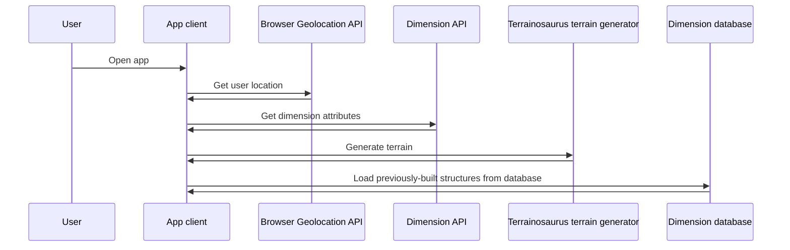
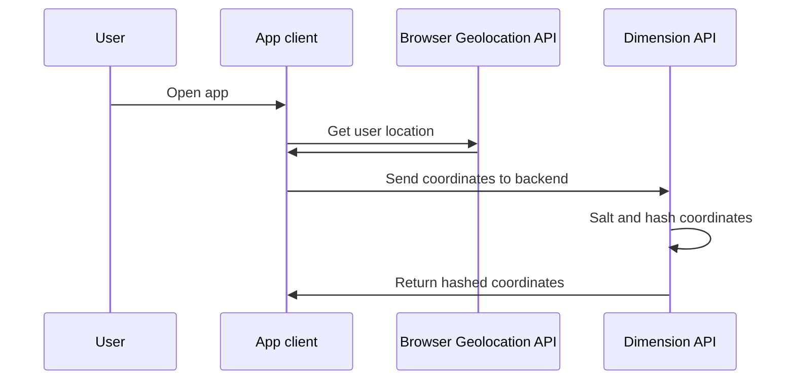
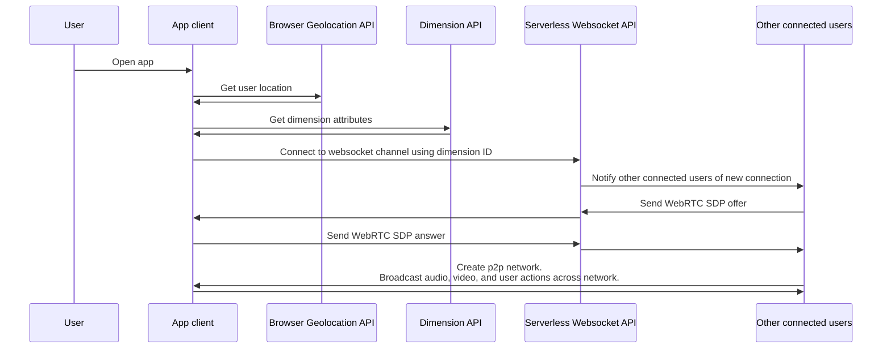
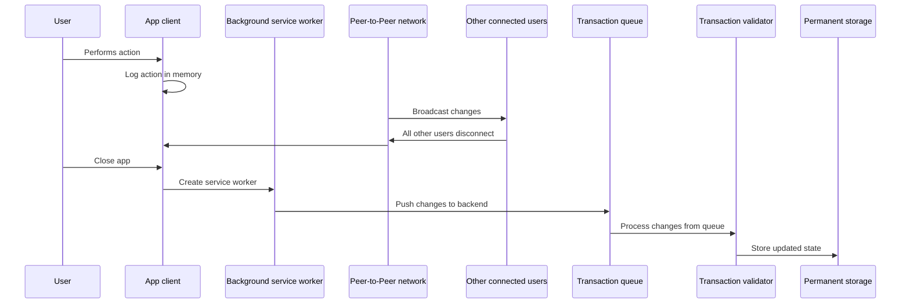

# Pocket Dimension Documentation

**NOTE:** At the time of writing, Pocket Dimension is still a work in progress. Some sections of this documentation are aspirational, and indicate an intended final state rather than the current implementation.

## Using Pocket Dimension

> 📣 When Pocket Dimension's crowdfunding campaign goes live, this section will include links to YouTube Shorts that show the flows in question.

Pocket Dimension works best on a mobile device or VR headset. It's a web app, so simply navigate to [pocketdimension.io](https://pocketdimension.io) to get started. Once Pocket Dimension loads, you'll be prompted for location permissions. Once Pocket Dimension reads your location, you'll be able to view terrain, check what resources are available, look for connected users, and enter the dimension.

Once the user enters a dimension, they can use the trackpad to walk around and explore the landscape. A number of glowing purple orbs randomly appear and disappear across the terrain. These orbs are resource generators. Each orb produces some default number of resources at regular intervals. Interacting with orb increases a counter. When the orbs generate resources, the number of resources they generate increases based on this counter. The counter resets whenever resources are generated. This allows users to either actively or passively collect resources. The number of resources generated is one of the dimension properties, just like the resource types and shape of the landscape. If you're very lucky, you'll find a dimension that generates a large base number of rare resources.

Resources can be used to build things. Pocket Dimension has a simple 3D modeling system that's optimized for either touch screens or VR controllers. To use the build system, scroll to the "build" option in the action selector near the bottom of the screen. This will cause a list of available objects to appear. Touching anywhere on the screen will create an object. Touching this object with the "interact" action selected allows you to change the object's size, position, and rotation. Dragging your finger horizontally or vertically changes the size of the object. If you have the "rotate" mode enabled, a one-finger drag will rotate the object instead. A two-finger drag moves the object.

Group selection and blueprints are important parts of Pocket Dimension's build system. Tapping on additional objects while in "interact" mode allows you to select things. This allows you to transform multiple things at once. Tapping the "group" button while multiple objects are selected makes these groups permanent. Groups can be easily copied selecting "build copy" in the action menu. Groups can be turned into blueprints, which can be reused even more easily and even shared with other users.

## The Pocket Dimension economy

Doing things in Pocket Dimension consumes energy and resources. Every user receives an alottment of energy per day. To exceed this amount of energy, users must do things to get other users to give them energy. Examples of energy transactions between users include:

* Visiting a dimension claimed by another user. Each minute you spend in their dimension sends energy from them to you.
* Selling resources to other users.
* Using another user's blueprints to build things.

Other interactions in Pocket Dimension cause energy to be destroyed.

* Building or resizing objects
* Collecting resources
* Using portals to travel to distant dimensions

Portals allow users to visit dimensions without being in their corresponding physical locations. Using a portal costs an amount of energy that increases exponentially with the distance between the physical locations. This incentivizes building a network of short hops in order to travel efficiently.

## Technical architecture

> 📣 Mermaid diagrams don't currently work on GitHub, but you can paste the diagrams listed below into an [online Markdown renderer](https://markdownlivepreview.com/).

### Geolocation sequence

The following diagram shows how users' GPS coordinates are used to deterministically generate terrain.

### Protecting users' privacy

Pocket Dimension reads users' locations. Here's how it ensures that people don't get doxxed while still allowing users to easily connect to each other.

The salted coordinate hash can be safely shared with others, since there's no way to reverse engineer the hash to get someone's location. Pocket Dimension also maintains privacy by simply keeping users anonymous.

### Multiplayer initialization sequence

The following diagram shows how Pocket Dimension creates peer-to-peer networks.
The exact process for creating WebRTC connections has been somewhat simplified for readability.

### Data persistence sequence

The following diagram details what occurs when users perform actions such as creating objects, spending energy, collecting resources, etc.
This process has been chosen in order to optimize costs and enable transaction validation without blocking user actions.

