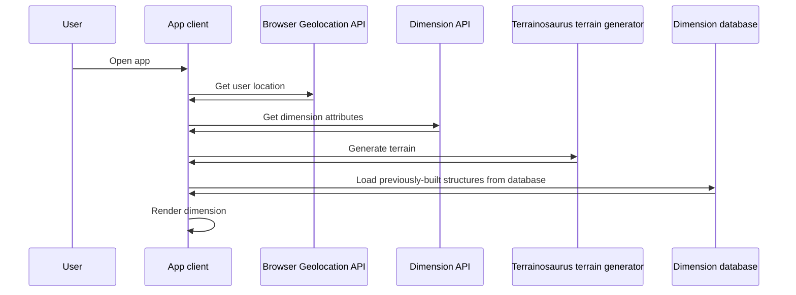
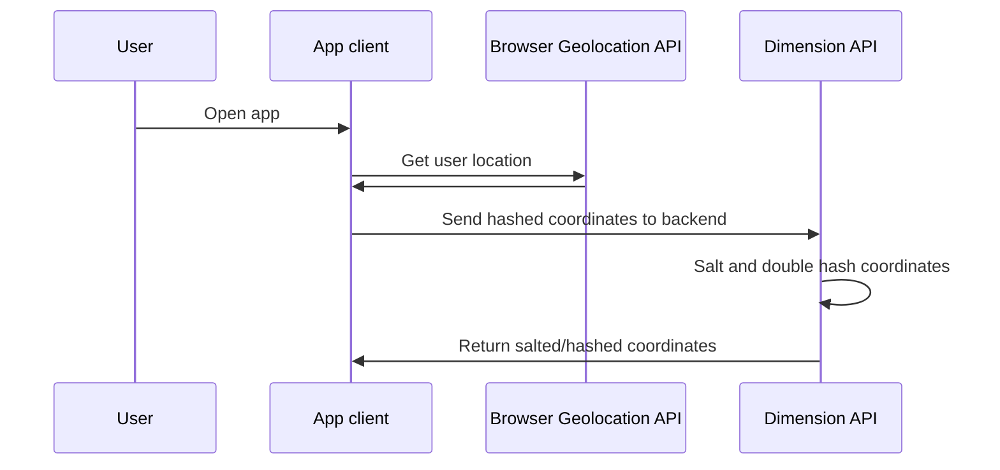
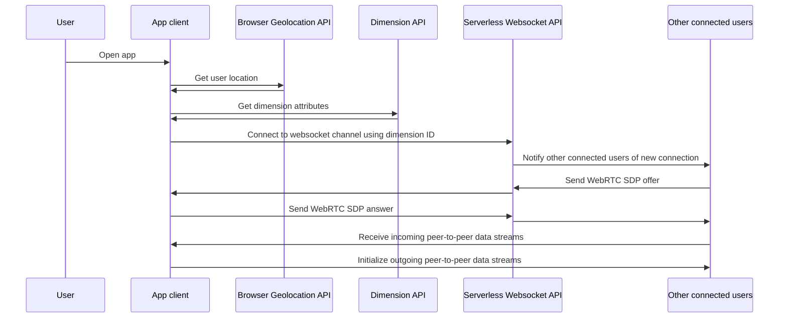
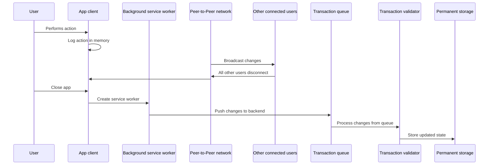

[🏠 Home](./)

# Pocket Dimension Documentation

---

_**NOTE:** At the time of writing, Pocket Dimension is still a work in progress. Some sections of this documentation are aspirational, and indicate an intended final state rather than the current implementation. In-progress features are denoted with a "🏗️", e.g., "Pocket Dimension will make you run faster, jump higher, and live longer (🏗️)". If you have questions about the exact implementation state or any other topic, please email [docs@pocketdimension.io](mailto://docs@pocketdimension.io)._

---

## Using Pocket Dimension

_🏗️ I'll eventually create video tutorials to make these description easier to follow. In the meantime, [the pitch video](https://youtu.be/Ol2s9Ntewts) has a few clips of what it's like to use Pocket Dimension._

Pocket Dimension works best on a mobile device or VR headset. It's a web app, so simply navigate to [pocketdimension.io](https://pocketdimension.io) to get started. Once Pocket Dimension loads, you'll be prompted for location permissions. Once Pocket Dimension reads your location, you'll be able to view terrain, check what resources are available, look for connected users, and enter the dimension.

Once the user enters a dimension, they can use the trackpad to walk around and explore the landscape. A number of glowing purple orbs randomly appear and disappear across the terrain. These orbs are resource generators. Each orb produces some default number of resources at regular intervals. Interacting with orb increases a counter. When the orbs generate resources, the number of resources they generate increases based on this counter. The counter resets whenever resources are generated. This allows users to either actively or passively collect resources. The number of resources generated is one of the dimension properties (🏗️), just like the resource types and shape of the landscape. If you're very lucky, you'll find a dimension that generates a large base number of rare resources.

Resources can be used to build things. Pocket Dimension has a simple 3D modeling system that's optimized for either touch screens or VR controllers. To use the build system, scroll to the "build" option in the action selector near the bottom of the screen. This will cause a list of available objects to appear. Touching anywhere on the screen will create an object. Touching this object with the "interact" action selected allows you to change the object's size, position, and rotation. Dragging your finger horizontally or vertically changes the size of the object. If you have the "rotate" mode enabled, a one-finger drag will rotate the object instead. A two-finger drag moves the object.

Group selection and blueprints are important parts of Pocket Dimension's build system. Tapping on additional objects while in "interact" mode allows you to select things. This allows you to transform multiple things at once. Tapping the "group" button while multiple objects are selected makes these groups permanent. Groups can be easily copied selecting "build copy" in the action menu. Groups can be turned into blueprints, which can be reused even more easily and even shared with other users (🏗️).

## The Pocket Dimension economy

Doing things in Pocket Dimension consumes energy and resources. Every user receives an alottment of energy per day. To exceed this amount of energy, users must do things to get other users to give them energy. Examples of energy transactions between users include:

* Visiting a dimension claimed by another user. Each minute you spend in their dimension sends energy from them to you. (🏗️)
* Selling resources to other users. (🏗️)
* Using another user's blueprints to build things. (🏗️)

Other interactions in Pocket Dimension cause energy to be destroyed.

* Building or resizing objects
* Collecting resources
* Using portals to travel to distant dimensions (🏗️)

Portals allow users to visit dimensions without being in their corresponding physical locations. Using a portal costs an amount of energy that increases exponentially with the distance between the physical locations. This incentivizes building a network of short hops in order to travel efficiently.

## Advanced building topics

Simple blueprints in Pocket Dimension are static collections of basic shapes like cubes and spheres. Advanced blueprints are also collections of basic shapes, but they can also execute simple scripts. Blueprints cost a certain amount of energy and resources to build. The amounts depend on the size of the individual pieces.

Adding scripts to blueprints requires that the blueprint contain certain amounts of certain resources. For example, in the current provisional draft (which is not yet published due to its incompleteness), adding animations to structures requires a resource called "dynamium". The amount of dynamium required will depend on how far and how fast the blueprint moves, and the size of the moving pieces. Another provisional example includes requiring hematite to create structures that cause resource drops to spawn nearby. (🏗️)

These design requirements are included to prevent users from creating cheap game-breaking inventions, adding a functional element to the design process, and ensuring affordance (i.e., allowing a thing's function to be intuited from its form).

## Claiming dimensions

The first step to claiming a dimension is to visit its physical location. Once you do this, you'll be able to stake a claim to it. If you claim a dimension, you can choose to make it public, private, or invite-only. Claims to dimensions only last 1 week. You'll have to keep visiting that location to refresh your claim. If your claim expires, anyone else that visits will be able to claim the dimension for themselves. They'll have to give some energy to buy out your claim, and the amount of energy required depends on how much stuff you've built in the dimension. If you want to ensure that you never lose your dimension, you can build a massive structure that will take days to buy. (🏗️)

## Technical architecture

### The basics

Pocket Dimension is a web application that uses A-Frame to render 3D content with support for VR, native web components for its UI layer, WebRTC for multiplayer connections, and a collection of serverless backend endpoints to bootstrap peer-to-peer connections, persist data, handle user management, etc.

Several key design elements keep Pocket Dimension as performant as possible. Web Workers are used during the terrain generation process, allowing expensive vertex calculations to be performed without interrupting the main thread. Pocket Dimension keeps its bundle size below 7MB by careful dependency management, and the CacheStorage API is used such that the majority of this bundle is stored on the device (🏗️).

### Geolocation sequence

The following diagram shows how users' GPS coordinates are used to deterministically generate terrain.

It should be noted that the terrain generated is **not** based on real-world topographical data. This is a design choice influenced by constraints such as GPS precision, sourcing the topographical data, and the simple fact that users will be able modify the landscape at will (🏗️). While it may be technically feasible to enable some kind of scanning or importing feature later, this is not something that will be in the initial release.

### Protecting users' privacy

Pocket Dimension reads users' locations. Here's how it ensures that people don't get doxxed while still allowing users to easily connect to each other.

The salted coordinate hash can be safely shared with others, since there's no way to reverse engineer the hash to get someone's location. Pocket Dimension also maintains privacy by simply keeping users anonymous. This anonymity is in some ways more useful than salting and hashing the coordinates, since it protects users not just from third-party attackers, but from Pocket Dimension itself.

### Multiplayer initialization sequence

The following diagram shows how Pocket Dimension creates peer-to-peer networks.
The exact process for creating WebRTC connections has been somewhat simplified for readability.

### Data persistence sequence

The following diagram details what occurs when users perform actions such as creating objects, spending energy, collecting resources, etc.
This process has been chosen in order to optimize costs and enable transaction validation without blocking user actions.

(🏗️ While a provisional data persistence system is in place, it will not be cost-effective with thousands of users. This document shows the long-term plan, which should be over 100x less costly.)

## Roadmap

_This section is subject to change. Topics will be introduced and reprioritized based on user feedback._

Future development topics include:

* Improved terrain
  * Increased variety
  * Grass
  * Manual terraforming
  * Terrain features like rivers
  * Better Level of Detail management
* Blueprint features
  * Blueprint sharing
  * Script attachment
  * Additional resources
* Backend infrastructure cost optimization
* Anti-cheat system
* Economy features for resource exchange between users
